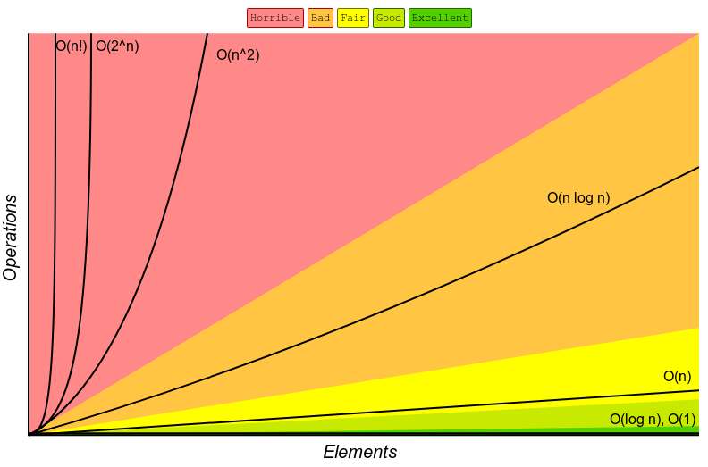

## What's Big O?

Consider this function:

```js
const nemo = ["nemo"];
const large = new Array(10000).fill("nemo");
function findNemo(array) {
  let t0 = performance.now();
  for (let i = 0; i < array.length; i++) {
    if (array[i] === "nemo") {
      console.log("Found NEMO!");
    }
  }
  let t1 = performance.now();
  console.log(`Call to find Nemo took ${t1 - t0} ms`);
}

findNemo(large);
```

As we increase the length of array, the code becomes slower. If I run the code in my computer, the time recorded by `performance` is going to be different that running in on another computer. We are gonna get frustrated because everytime we run the code, the time is going to be different. It all depends on how powerful CPU in the computer is and many other factors.

So how can we make sure there's a way for us to measure in terms of efficiency what is good code and what is bad code and what is code that can scale? So **Big O** notation is the language we use for talking about how long an algorithm takes to run.

When we talk about Big O and scalability of code we simply mean when we grow bigger and bigger with out input. How much our algorithm or function slow down.

In case of the above example, As the list of characters increases, How many more operations do we need to do:



So instead of using `performance.now()` or using time to measure the efficiency of our function we can just calculate how many operations a computer has to perform. Because each operation takes time on a computer

**Big-O** allows us how many steps it takes, in a function.
