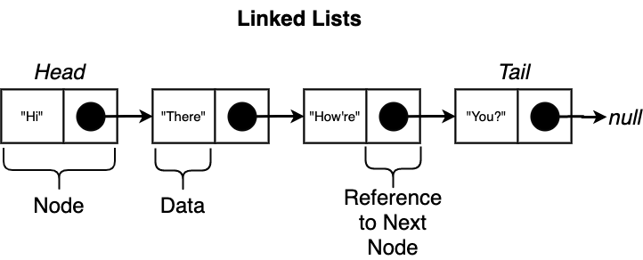

## Linked Lists

A Linked List is an ordered collection of data, the collection contains a number of different nodes. Each node contains some amount of data along with a reference to the next node



So it's a list of linked nodes.

```js
const nodeOne = {
  data: 123
};

const nodeTwo = {
  data: 456
};

nodeOne.next = nodeTwo;
```

## Node Implementation

```js
class Node {
  constructor(data, next = null) {
    this.data = data;
    this.next = next;
  }
}
```

## Linked List Implementation

```js
class LinkedList {
  constructor() {
    this.head = null;
  }

  // to be added
}
```

### InsertFirst

```js
class LinkedList {
  // as before

  insertFirst(data) {
    this.head = new Node(data, this.head);
  }
}
```

### Size

```js
class LinkedList {
  // as before

  size() {
    let counter = 0;
    let node = this.head;

    while (node) {
      counter++;
      node = node.next;
    }

    return counter;
  }
}
```

### GetFirst

```js
class LinkedList {
  // as before

  getFirst() {
    return this.head;
  }
}
```

### GetLast

```js
class LinkedList {
  // as before

  getLast() {
    if (!this.head) return null;

    let node = this.head;
    while (node) {
      if (!node.next) return node;
      node = node.next;
    }
  }
}
```

### Clear

```js
class LinkedList {
  // as before

  clear() {
    this.head = null;
  }
}
```

### RemoveFirst

```js
class LinkedList {
  // as before

  removeFirst() {
    if (!this.head) {
      return;
    }

    this.head = this.head.next;
  }
}
```

### RemoveLast

```js
class LinkedList {
  // as before

  removeLast() {
    if (!this.head) {
      return;
    }

    if (!this.head.next) {
      this.head = null;
      return;
    }

    let previous = this.head;
    let node = this.head.next;
    while (node.next) {
      previous = node;
      node = node.next;
    }
    previous.next = null;
  }
}
```

### InsertLast

```js
class LinkedList {
  // as before

  insertLast(data) {
    let last = this.getLast();
    if (last) {
      last.next = new Node(data);
    } else {
      this.head = new Node(data);
    }
  }
}
```

### InsertLast

```js
class LinkedList {
  // as before

  getAt(index) {
    let counter = 0;
    let node = this.head;
    while (node) {
      if (counter === index) {
        return node;
      }

      counter++;
      node = node.next;
    }
    return null;
  }
}
```

### GetAt

```js
class LinkedList {
  // as before

  getAt(index) {
    let counter = 0;
    let node = this.head;
    while (node) {
      if (counter === index) {
        return node;
      }

      counter++;
      node = node.next;
    }
    return null;
  }
}
```

### RemoveAt

```js
class LinkedList {
  // as before

  removeAt(index) {
    if (!this.head) {
      return;
    }

    if (index === 0) {
      this.head = this.head.next;
      return;
    }

    const previous = this.getAt(index - 1);
    if (!previous || !previous.next) {
      return;
    }
    previous.next = previous.next.next;
  }
}
```

### InsertAt

```js
class LinkedList {
  // as before

  insertAt(data, index) {
    if (!this.head) {
      this.head = new Node(data);
      return;
    }

    if (index === 0) {
      this.head = new Node(data, this.head);
      return;
    }

    const previous = this.getAt(index - 1) || this.getLast();
    const node = new Node(data, previous.next);
    previous.next = node;
  }
}
```

### forEach

```js
class LinkedList {
  // as before

  forEach(fn) {
    let node = this.head;
    let counter = 0;
    while (node) {
      fn(node, counter);
      node = node.next;
      counter++;
    }
  }
}
```

### Linked Lists with Iterators

```js
class LinkedList {
  // as before

  *[Symbol.iterator]() {
    let node = this.head;
    while (node) {
      yield node;
      node = node.next;
    }
  }
}
```
