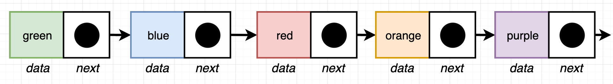
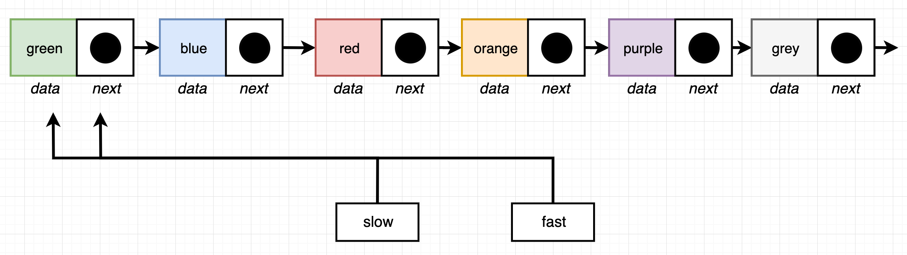

## Directions

Return the 'middle' node of a linked list. If the list has an even number of elements, return the node at the end of the first half of the list. _Do not_ use a counter variable, _do not_ retrieve the size of the list, and only iterate through the list one time.

## Example

```js
const l = new LinkedList();
l.insertLast("a");
l.insertLast("b");
l.insertLast("c");
midpoint(l); // returns { data: 'b' }
```

## Solution

For example we have five elements, the center element (midpoint) would be red:



**NOTE**: If there are even number of elements, we want to return the node at the end of the first half of the list.

For solving it we are going to create two temporary variables (`slow`, `fast`). We are going to take both these elements and point them at the first node in our linked list:



After we do that initial assigment we will then start to iterate through our linked list, for every step of iteration, we are going to advance:

- `slow` variable forward by one element
- `fast` variable forward by two elements

We do this process until there are two elements after `fast` element defined. Then we return `slow` (`the node at the end of the first half of the list`):

```js
function midpoint(list) {
  let slow = list.getFirst(); // list.head;
  let fast = list.getFirst();

  while (fast.next && fast.next.next) {
    slow = slow.next;
    fast = fast.next.next;
  }

  return slow;
}
```
