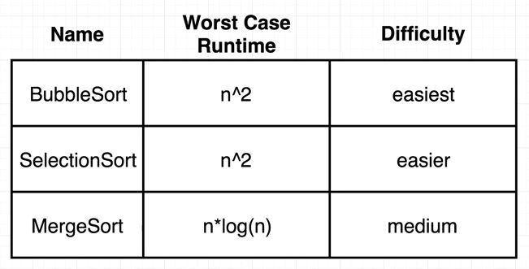

## Directions

## Implement bubbleSort, selectionSort, and mergeSort



### bubbleSort

- From `i = 0` to array length
  - From `j = 0` to (array length - `i`)
    - If the element at `j` is greater than `j + 1`
      - Swap elements at `j` and `j + 1`

### Solution

```js
function bubbleSort(arr) {
  for (let i = 0; i < arr.length; i++) {
    for (let j = 0; j < arr.length - i - 1; j++) {
      if (arr[j] > arr[j + 1]) {
        const lesser = arr[j + 1];
        arr[j + 1] = arr[j];
        arr[j] = lesser;
      }
    }
  }
  return arr;
}
```
