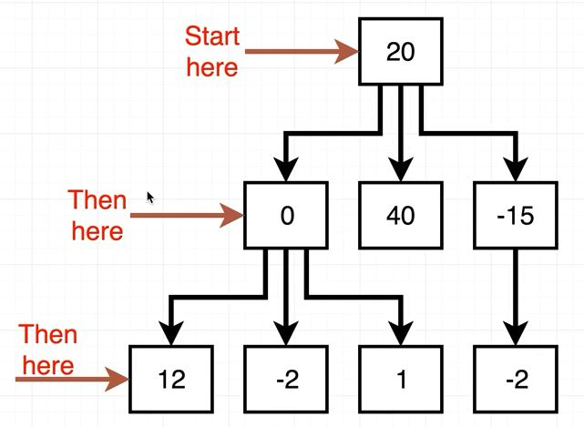
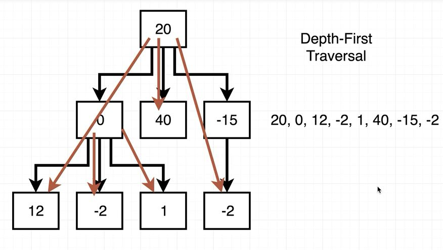

## Directions

1. Create a node class. The constructor should accept an argument that gets assigned to the data property and initialize an empty array for storing children. The node class should have methods 'add' and 'remove'.
2. Create a tree class. The tree constructor should initialize a 'root' property to null.
3. Implement 'traverseBF' and 'traverseDF' on the tree class. Each method should accept a function that gets called with each element in the tree

## Solution

### Node class

```js
class Node {
  constructor(data) {
    this.data = data;
    this.children = [];
  }

  add(data) {
    this.children.push(new Node(data));
  }

  remove(data) {
    this.children = this.children.filter(n => n.data !== data);
  }
}
```

### Tree class

#### Breadth-First Traversal



#### Depth-First Traversal



```js
class Tree {
  constructor(root = null) {
    this.root = root;
  }

  traverseBF(fn) {
    const arr = [this.root];
    while (arr.length) {
      const node = arr.shift();

      arr.push(...node.children);
      fn(node);
    }
  }

  traverseDF(fn) {
    const arr = [this.root];
    while (arr.length) {
      const node = arr.shift();

      arr.unshift(...node.children);
      fn(node);
    }
  }
}
```
